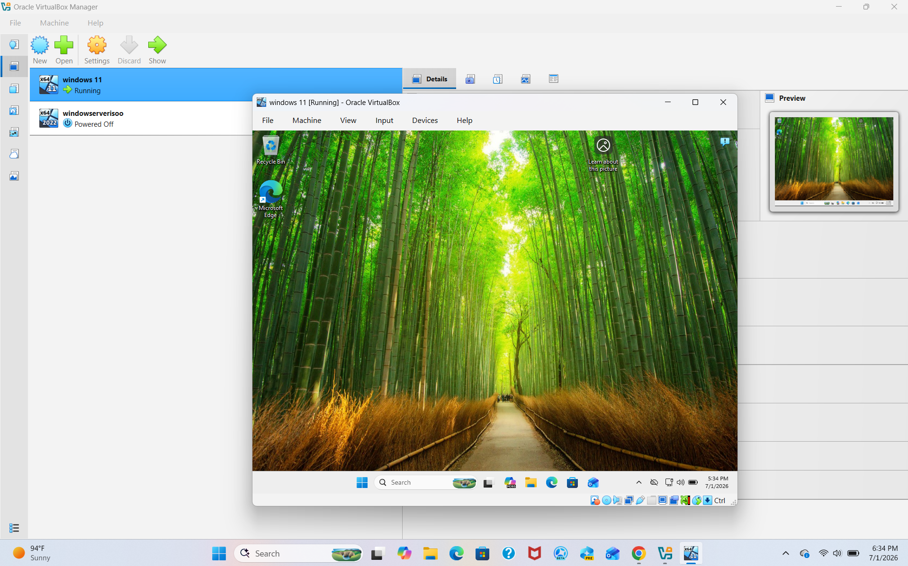
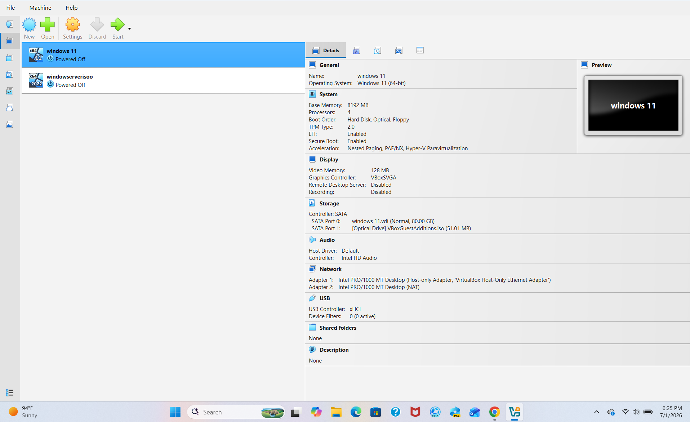
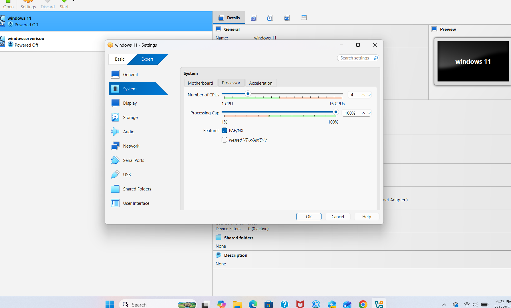
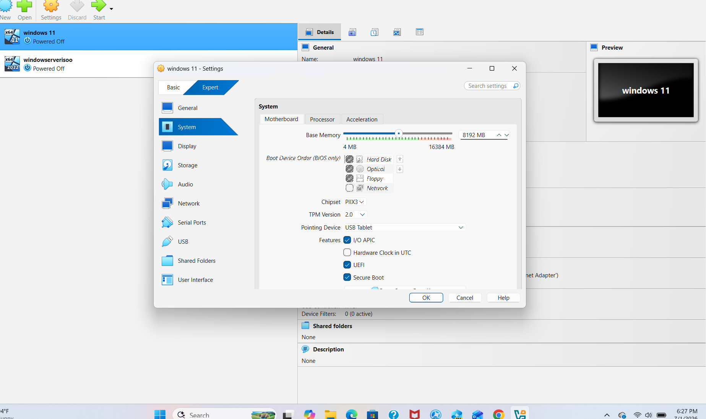
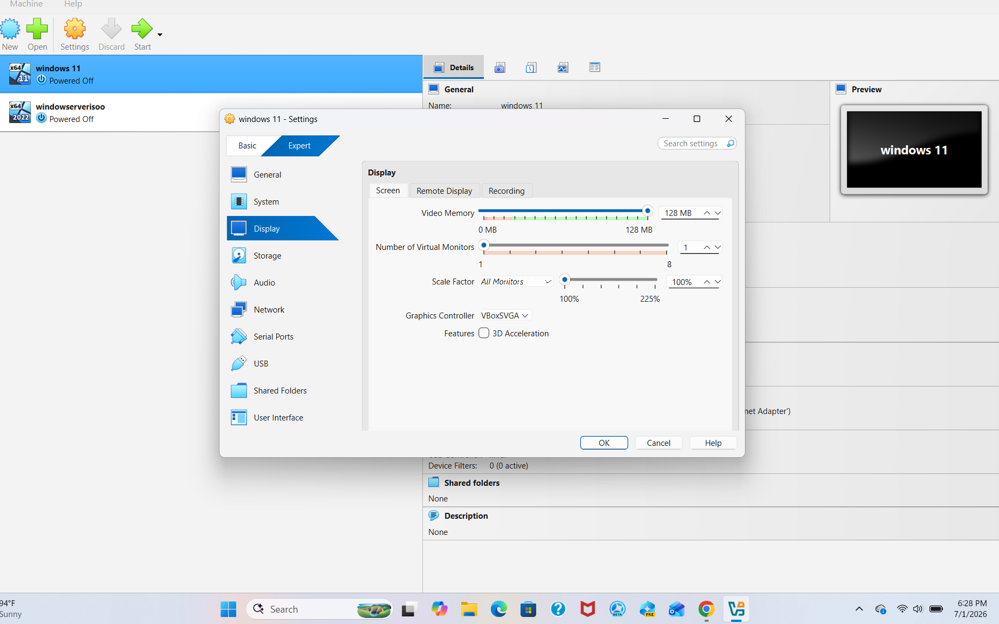

# Windows 11 VirtualBox Lab

## Objective
Install Windows 11 in VirtualBox and learn basic virtualization.

## Tools Used
- VirtualBox
- Windows 11 ISO
- Windows PC

## Skills Practiced
- Virtual machine setup
- Operating system installation
- Troubleshooting

## Steps Taken
1. Created a new virtual machine.
2. Added the Windows 11 ISO.
3. Configured RAM, storage, TPM, and Secure Boot.
4. Installed Windows 11.
5. Tested the virtual machine after installation.

## Problems Encountered
The VM showed a black screen during setup.

## Solution
Adjusted the VM settings and restarted the installation process.

## What I Learned
I learned how to create a virtual machine, install an operating system, and troubleshoot startup problems.
## Screenshots

### Windows Desktop

### Windows Home Screen

### Windows CPU

### Screenshot 1

### Screenshot 2

